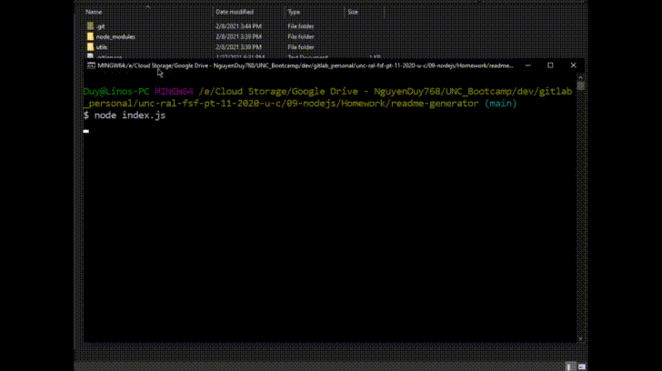

# README File Generator

## Description
    
This CLI application dynamically creates a profressional README & License file from a user's input for a new project

## Table of Contents

* [Installation](#installation)
* [Usage](#usage)
* [Preview](#preview)
* [License](#license)
* [Questions](#questions)

## Installation

Run `npm install` to install the required npm packages

## Usage

Run `node index.js`, then the application will ask you a series of questions about your project, optional questions can be left blank. A new README & License file will be created under the _export folder

## Preview

## License

This application is licensed under the terms of MIT

See [LICENSE](./LICENSE) file for details

## Questions

If you have any questions, you can reach me through my github or email below

Github: [LinosM](https://github.com/LinosM)

Email: [NguyenDuy768@gmail.com](mailto:NguyenDuy768@gmail.com)
